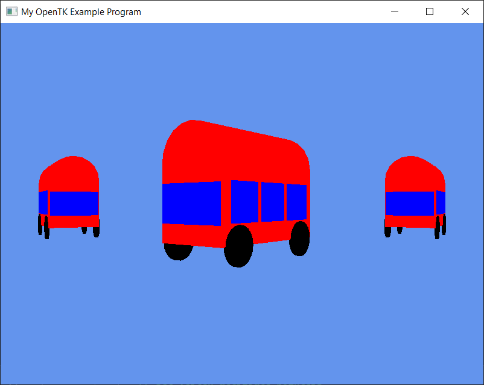

# Overall reflection
*As you look back on the project as a whole, you should reflect on your experience in this section. You should include information that makes it clear what you have contributed to the project and demonstrates your understanding of the concepts and techniques that you have applied. You should also consider aspects such as what you would do differently when you undertake a project such as this in the future. This could span elements of team working, project management, use of technology, etc.*
# Week 1 reflection
*This section should have you reflecting back on your contribution and experience during the first week. It can cover the same range of topics as the overall reflection.*
# Week 2 reflection
*This section should have you reflecting back on your contribution and experience during the second week. It can cover the same range of topics as the overall reflection.*
# Week 3 reflection
*This section should have you reflecting back on your contribution and experience during the third week. It can cover the same range of topics as the overall reflection.*
# Week 4 reflection
*This section should have you reflecting back on your contribution and experience during the fourth week. It can cover the same range of topics as the overall reflection.*

# Examples of Code Snippets and Figures to support your explanations
*You may like to support your reflections with code snippets and screenshots or other images. Below is example markdown for including them. You can delete this section once you know what you are doing.*
```c#
public static void Main()
{
    var nativeWindowSettings = new NativeWindowSettings
    {
        Size = new Vector2i(800, 600),
        Title = "My OpenTK Example Program"
    };

    using (var window = new MyExampleWindow(GameWindowSettings.Default,
                                            nativeWindowSettings))
    {
        window.Run();
    }
}
```
*Snippet 1 - from Program.cs Line 12*


*Figure 1 - The Busses*